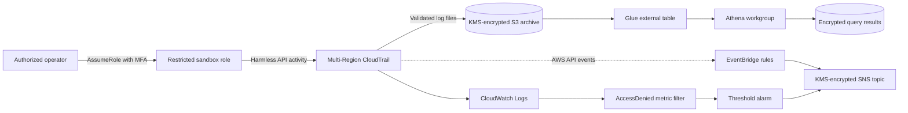

# AWS CloudTrail IAM Detection Lab

An isolated, low-cost cloud-security lab that turns AWS control-plane activity
into actionable detections and a reproducible investigation. The project joins
secure Terraform, CloudTrail, EventBridge, CloudWatch, SNS, Athena, incident
response, and portfolio-safe evidence handling in one defensive workflow.

> [!IMPORTANT]
> No AWS deployment has been performed. All included alerts, CloudTrail events,
> timelines, and query results are clearly labeled synthetic. Review
> [VALIDATION.md](VALIDATION.md) before interpreting any result.

## What I built

- Reusable Terraform for an encrypted multi-Region CloudTrail pipeline.
- A restricted, MFA-gated sandbox role for harmless authorized and denied calls.
- Four EventBridge detections and one threshold-based CloudWatch detection.
- A private S3 archive and cost-constrained Athena investigation path.
- KMS-encrypted SNS alerting and AWS Budget thresholds.
- Synthetic CloudTrail fixtures, a dependency-free test harness, and a coherent
  incident investigation.
- Credential-free CI, Checkov IaC scanning, and CodeQL SAST for the Python code.

## Architecture



See [architecture/architecture.md](architecture/architecture.md) for trust
boundaries, data flows, and design decisions.

## Detection coverage

| ID | Detection | AWS mechanism | MITRE ATT&CK | Validation |
| --- | --- | --- | --- | --- |
| AWS-CT-001 | Root-account activity | EventBridge | T1078.004 | Synthetic |
| AWS-CT-002 | CloudTrail configuration change | EventBridge | T1562.008 | Synthetic |
| AWS-CT-003 | IAM access-key creation | EventBridge | T1098.001 | Synthetic |
| AWS-CT-004 | Privileged policy attachment | EventBridge | T1098 | Synthetic |
| AWS-CT-005 | Repeated sandbox `AccessDenied` calls | CloudWatch metric alarm | T1087.004 (contextual) | Synthetic; live test planned |

Full logic, triage guidance, false positives, and containment steps are in the
[detection catalog](detections/catalog.md).

## Repository map

```text
architecture/     Architecture narrative and Mermaid source
detections/       Detection catalog and deployable EventBridge patterns
docs/             Safety, cost, deployment, investigation, and sanitization
evidence/         Synthetic alerts, investigation results, and evidence index
policies/         Least-privilege policy examples
queries/          Placeholder-based Athena SQL
reports/          Incident report template and sanitized sample report
scripts/          Local fixture evaluator; never calls AWS
terraform/        Reusable modules and the lab environment
tests/            Repository, detection, and sanitization tests
```

The executable workflows live in `.github/workflows/` and run directly from
this standalone repository.

## Local validation

The Python tests use only the standard library:

```powershell
python -m unittest discover -s tests -v
python scripts/validate_fixtures.py
```

When Terraform and Checkov are installed:

```powershell
terraform -chdir=terraform/environments/lab fmt -check -recursive
terraform -chdir=terraform/environments/lab init -backend=false
terraform -chdir=terraform/environments/lab validate
checkov -d terraform --framework terraform
```

These commands do not deploy AWS resources. `terraform plan` and `apply` remain
separately gated; see [docs/deployment-plan.md](docs/deployment-plan.md).

## Safe activity generation

Only a restricted sandbox role may be used. The planned live validation calls
read-only APIs and deliberately attempts a denied `iam:ListUsers` request. It
does not stop CloudTrail, create access keys, or attach privileged policies.
The exact procedure is in
[docs/safe-activity-generation.md](docs/safe-activity-generation.md).

## Investigation

The SQL under `queries/` covers principal activity, source IP activity, denied
calls, IAM policy changes, access-key changes, CloudTrail changes, and a
chronological timeline. Every database and table name is a replaceable
placeholder. The [sample report](reports/sanitized-sample-incident-report.md)
uses reserved IP space and synthetic identities.

## Cost and safety controls

- First-copy management events only; no paid data events or CloudTrail Lake.
- 14-day CloudWatch retention and configurable S3 lifecycle expiration.
- One customer-managed KMS key, reused where the key policy permits.
- 100 MiB Athena per-query scan cutoff.
- `$5` monthly budget with 50%, 80%, and 100% SNS thresholds.
- `force_destroy = false` by default to prevent accidental evidence deletion.

Expected quiet-lab cost is roughly `$1–$3/month`, primarily the KMS key, but
pricing is Region- and usage-dependent. Budgets alert after billing data is
processed and are not a hard cap. See [docs/cost-and-safety.md](docs/cost-and-safety.md).

## Limitations

- Local pattern tests are not proof that AWS delivered or matched an event.
- `AccessDenied` is a weak signal without API, principal, and source context.
- The privileged-policy rule covers an explicit high-risk allow-list; it does
  not perform semantic analysis of arbitrary inline policies.
- CloudTrail, EventBridge, alarms, email delivery, and Athena remain unverified
  until an explicitly approved AWS deployment occurs.
- This educational single-account design is not a substitute for an
  organization trail, centralized security account, SCPs, or a production SIEM.

## Teardown

Follow [TEARDOWN.md](TEARDOWN.md). Encrypted log and query buckets must be
emptied intentionally before Terraform can remove them, and KMS deletion has a
mandatory waiting period.

## Security disclaimer

Use only in an AWS account you own or are explicitly authorized to test. Never
put AWS credentials, live CloudTrail records, account identifiers, personal
information, or production resource names in this repository. See
[SECURITY.md](SECURITY.md).

## Resume-ready bullet

> Built an AWS CloudTrail/IAM detection lab with Terraform, EventBridge,
> CloudWatch, SNS, KMS, S3, and Athena; engineered five MITRE-mapped detections,
> automated IaC/SAST testing, and produced a sanitized incident investigation
> without using real credentials or destructive cloud activity.
